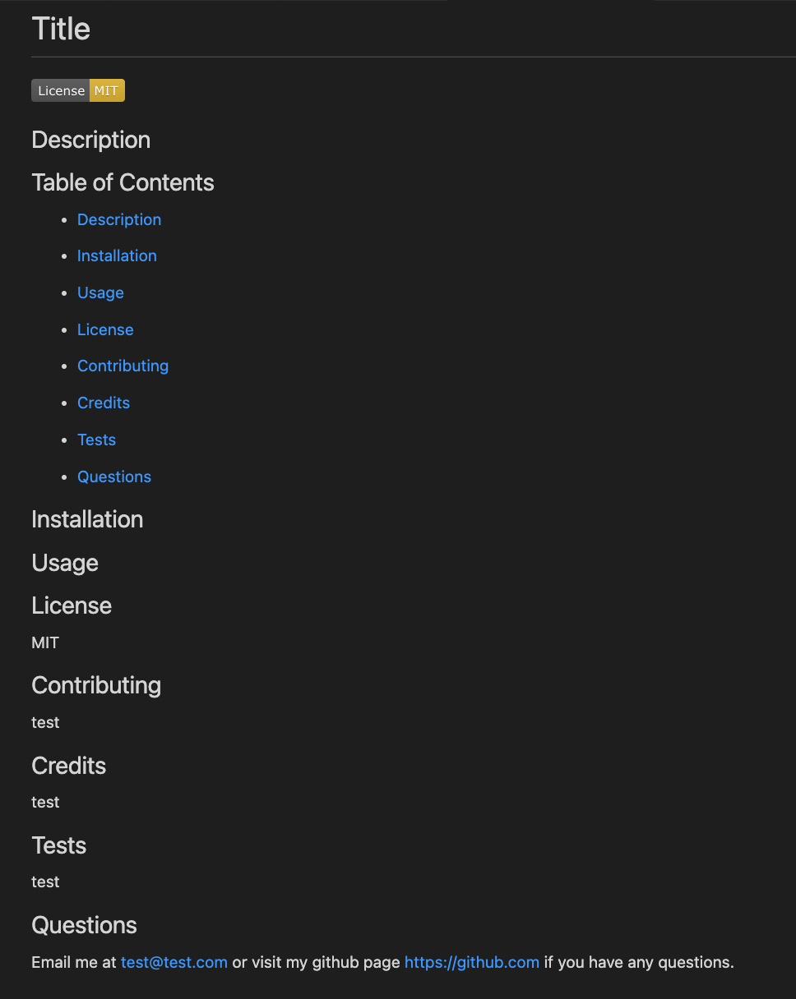

# readme file generator

## Description

This program will generate a readme file from the user input.

## Table of Contents

- [Description](#description)

- [Installation](#installation)

- [Usage](#usage)

- [License](#license)

- [Contributing](#contributing)

- [Credits](#credits)

- [License](#license)

- [Tests](#tests)

- [Questions](#questions)

## Installation

The project is run using node js. You will need to clone the repository. Navigate to the Develop file in the terminal. Make sure to install the programs in the package.json file by running (which includes inquirer8.2.4) by running "npm install" from the command line. Then run "node index.js" from the command line. Follow the prompts to populate your readme file!

## Usage

## License

MIT

## Contributing

Feel free to contribute!

## Credits

Thanks to eveyone at edX coding bootcamps!

## Tests

N/A

## Questions

Email me at bcebel@gmail.com or visit my github page https://github.com/bcebel if you have any questions.
